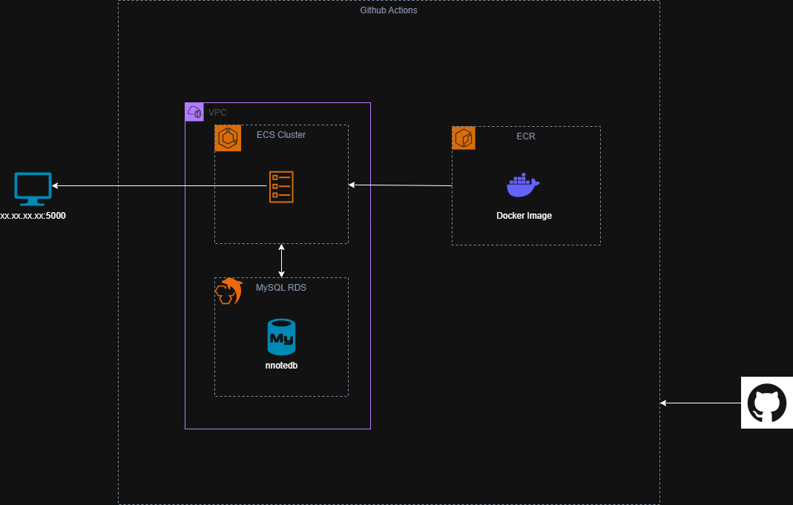

# Flask WebApp with GitHub Actions, AWS OIDC, Terraform, and AWS RDS



## Overview
This project is a web application built using Python Flask and hosted on AWS Cloud Infrastructure. The deployment is automated using GitHub Actions (GHA) with AWS OpenID Connect (OIDC) authentication. Terraform is used for IaC to provision AWS resources, including an ECS, ECR, VPC, RDS and permission groups.

## Tech Stack
- **Flask/Gunicorn**: Web framework for Python
- **GitHub Actions**: CI/CD pipeline for automated deployments
- **AWS OIDC**: Secure authentication for GitHub Actions to access AWS
- **Terraform**: Infrastructure as Code (IaC) to manage AWS resources
- **AWS RDS**: Relational database service
- **AWS ECS/ECR**: Ochestrated container task and service
- **AWS VPC**: Virtual network

## Prerequisites
Before setting up the project, ensure you have:
- AWS account with necessary IAM permissions
- GitHub repository with GitHub Actions enabled
- Terraform installed (`>= 1.x`)
- Python (`>= 3.11`) and pip installed
- Docker (for local testing)
- MySQL Workbench (for database testing)

## Setup Instructions

### 1. Clone the Repository
```bash
git clone https://github.com/nhatvo1502/python-website.git
cd python-website
```

### 2. Set Up Virtual Environment
```bash
python -m venv venv
source venv/bin/activate   # On Windows, use `venv\Scripts\activate`
pip install -r requirements.txt
```

### 3. Configure AWS Credentials (for local development)
```bash
aws configure
```

Alternatively, set up AWS OIDC in GitHub Actions for secure authentication.

### 4. Configure GitHub Actions
Create your own Data Base secrets: `DB_NAME`, `DB_PASSWORD`, `DB_USERNAME` in your GitHub repo by navigating to:

`Settings > Secrets and variables > Actions > Repository secrets`

### 5. Deploy Infrastructure Using GitHub Actions
```bash
git add .
git commit -m "Deploy"
git push origin main
```

### 5. Run Application Locally (as Container)
Require an existing [MySQL Database](https://dev.mysql.com/doc/refman/8.4/en/windows-installation.html)

Update `python-website/website/__init__.py` with your existing db connection

```bash
docker build -t nnote-app .
docker run -p 5000:5000 nnote-app
```

## Project Structure
```
python-website/
│── .github/workflows/
│   ├── deploy.yml
│   ├── destroy.yml
│── terraform/
│   ├── backend.tf
│   ├── main.tf
│   ├── network.tf
│   ├── variables.tf
│   ├── provider.tf
│   ├── security.tf
│   ├── outputs.tf
│── website/
│   ├── static/
│   │   ├── index.js
│   ├── templates/
│   │   ├── base.html
│   │   ├── home.html
│   │   ├── login.html
│   │   ├── reset_password.html
│   │   ├── sign_up.html
│   ├── __init__.py
│   ├── auth.py
│   ├── models.py
│   ├── views.py
│── requirements.txt
│── README.md
│── main.py
│── Dockerfile
```

## CI/CD Workflow
1. **Push to GitHub** → Triggers GitHub Actions workflow
2. **Authenticate using AWS OIDC**
3. **Create S3 bucket** to store Terraform backend
3. **Terraform applies changes** to AWS infrastructure
4. **Capture Terraform Outputs** to Gigthub Action runner env's variables
5. **Docker image is built and pushed** to Amazon ECR 
6. **Flask app is deployed** to AWS

## Cleanup
To remove AWS resources run `destroy.yml` from Github Actions

## Cleanup Workflow
1. **Authenticate using AWS OIDC**
2. **Terraform destroy** to remove all tracked AWS resources
3. **Delete S3 bucket** for Terraform backend

## For Database Management:
Install [MySQL Workbench](https://dev.mysql.com/downloads/workbench/)
DB endpoint can be found under `Print GHA Environment Variables` from Github Actions `built-script`

---
Feel free to contribute and enhance this project! 🚀